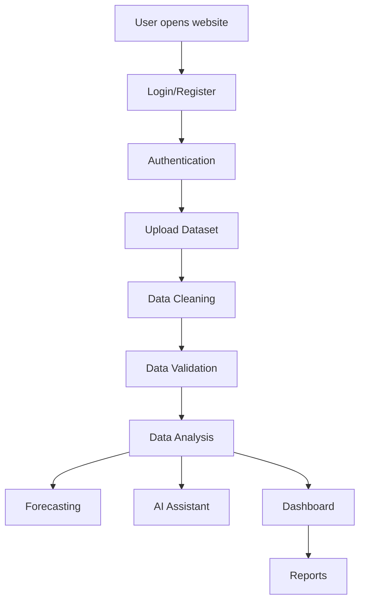
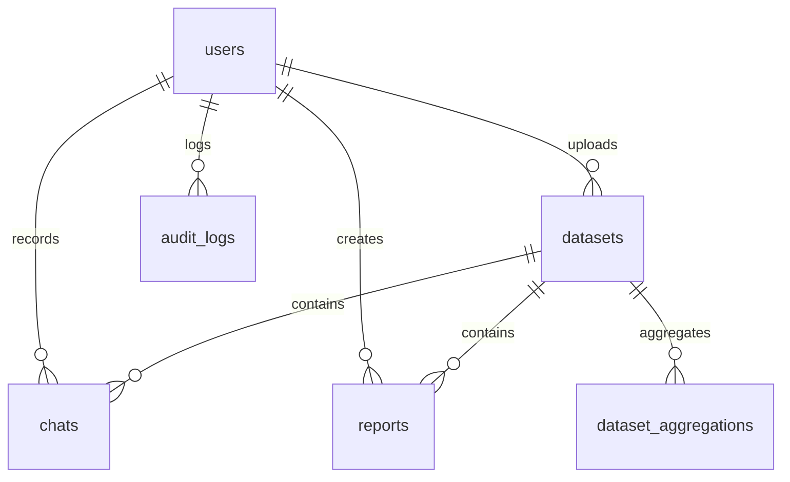
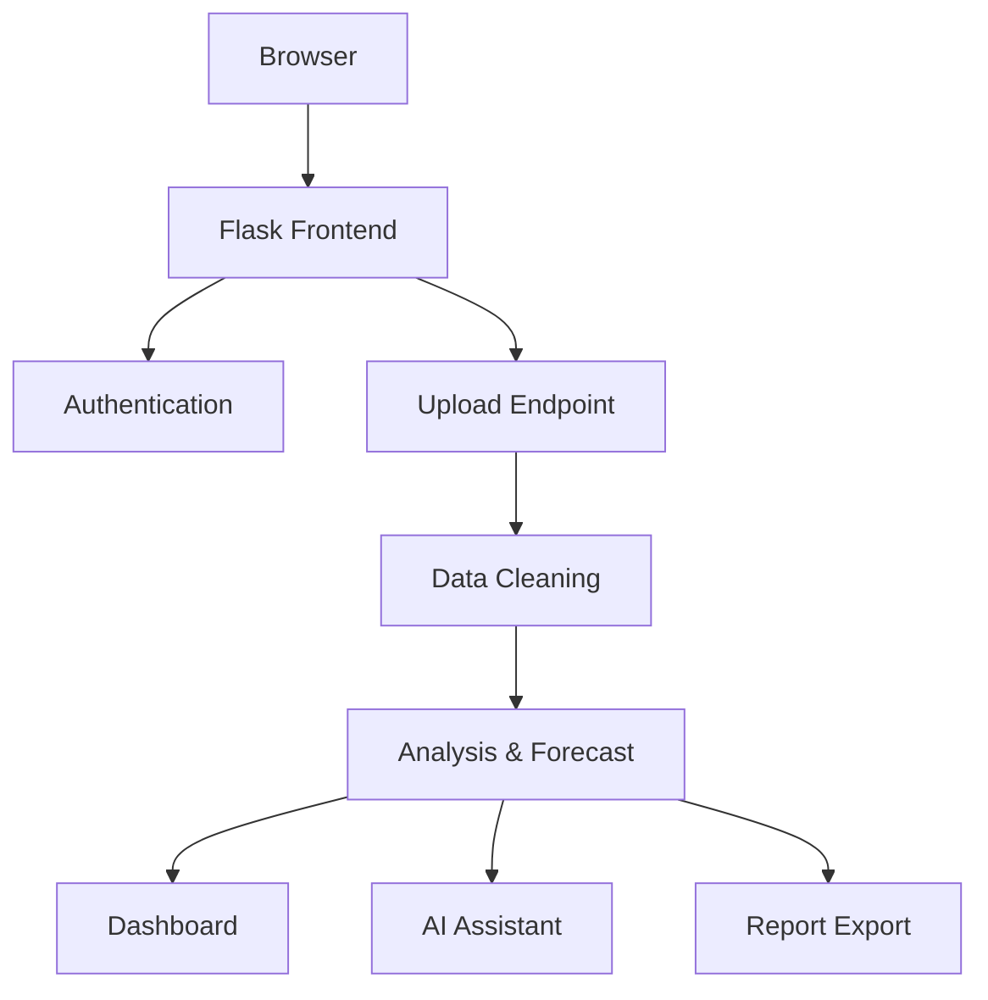

# InsightAI — Business Intelligence Platform

## Project Title
**InsightAI** — A dataset-driven business intelligence and AI assistant platform built on Flask.

## Project Abstract
InsightAI empowers business users, analysts, and decision-makers to upload raw datasets, automatically clean and validate them, and then generate actionable insights through dashboards, forecasting, and a natural language AI assistant. The platform is designed to work with CSV and Excel data, delivering analytics without requiring users to write code.

## Project Overview
InsightAI combines a secure Flask backend with a responsive frontend and a lightweight data pipeline. The system supports user authentication, dataset ingestion, automatic cleaning, KPI generation, trend forecasting, and interactive AI-assisted analysis.

## Problem Statement
Many organizations have valuable data trapped in spreadsheets or transactional files, but lack a consistent way to turn that data into business insights. Manual data cleaning, inconsistent metrics, and analysis complexity slow decision-making and reduce trust in the numbers.

## Objectives
- Provide secure user authentication and dataset management.
- Automatically clean and validate uploaded datasets.
- Enable analytics and forecasting from business data.
- Offer an AI assistant for natural language questions over the uploaded dataset.
- Produce exportable reports and audit history.

## Motivation
Business teams need a single platform that converts raw dataset uploads into reliable insights. InsightAI was built to reduce the gap between messy datasets and actionable business intelligence.

## Real-world Business Use Cases
- Sales teams upload transaction records and ask, "Which product has the highest revenue?"
- Finance teams generate quarterly reports and forecast future sales using historical data.
- Operations managers analyze regional performance and identify underperforming territories.
- Customer success teams calculate repeat customer rates and churn from CRM-style datasets.

## Key Features
### Authentication and Authorization
- Secure registration and login flows
- Password hashing with Werkzeug
- Session-based login and JWT support for API access
- Admin-only routes for user management and audit review

### Dataset Upload and Storage
- Supports CSV, XLS, and XLSX uploads
- Stores raw file uploads in `uploads/`
- Saves metadata and analysis results in SQLite

### Data Cleaning and Validation
- Normalizes headers and column names
- Drops duplicate and empty rows
- Converts numeric strings and datetime values
- Fills missing data with medians or modes
- Applies outlier smoothing using a 3-sigma rule
- Computes a dataset quality score

### Analytics Dashboard
- KPI summary cards
- Time-series and category visualizations
- Region and product breakdowns
- Quick executive narrative summaries

### Forecasting Engine
- Monthly time-series aggregation
- Linear regression forecasting with `scikit-learn`
- Predicts next-period sales values when enough data exists

### AI Assistant
- Intent-based question answering
- Dataset-aware responses using actual Pandas calculations
- Supports sales, profit, customer, product, region, forecasting, and recommendation queries
- Stores conversation history for context

### Report Generation
- Exports quality and executive reports
- Generates downloadable report files in PDF or Excel format

### Admin Management
- User role management
- Audit logs of system actions
- Dataset and report history access

## Complete Project Workflow


## System Architecture
### Frontend
- `templates/` contains Jinja2 HTML pages for login, workspace, dashboard, and profile.
- `static/styles.css` contains UI styling.
- `static/app.js` and `static/landing.js` manage page behavior and AJAX calls.

### Backend
- `app.py` is the Flask application and contains all route definitions and data logic.
- Dataset cleaning and analysis logic are implemented server-side.
- Authentication, admin controls, uploads, assistant messaging, and exports are handled here.

### Database
- Uses SQLite (`insightai.db`) for persistence.
- Stores users, datasets, chats, reports, aggregations, and audit logs.

### Machine Learning
- Forecasting uses `LinearRegression` from `scikit-learn`.
- The assistant uses rule-driven intent detection and data-driven Pandas queries.

### AI Assistant
- Fuzzy column mapping connects dataset headers with business concepts.
- Intent detection maps questions to analytics actions.
- Responses are computed from actual dataset aggregates.

### Forecast Engine
- Aggregates data by month when a date column is available.
- Uses linear regression to generate short-term forecasts.

### Report Generator
- Creates report summary files and exports them from the backend.

## Technology Stack
| Category | Technology |
| --- | --- |
| Language | Python |
| Framework | Flask |
| Libraries | pandas, numpy, scikit-learn, reportlab, bleach, SQLAlchemy, flask-jwt-extended |
| Database | SQLite |
| Visualization | Plotly-ready front-end charts |
| Authentication | Flask sessions, JWT |

## Folder Structure
| Folder/File | Description |
| --- | --- |
| `app.py` | Main Flask app and business logic |
| `requirements.txt` | Python dependencies |
| `README.md` | Project overview and quick start |
| `templates/` | Jinja2 templates for pages |
| `static/` | CSS and JavaScript assets |
| `uploads/` | Stored dataset files |
| `reports/` | Generated report files |
| `tests/` | Test cases for core functionality |
| `insightai.db` | SQLite persistence database |
| `sample_data.csv` | Demo dataset for testing |

## Database Documentation
### Database: `insightai.db`

### Tables and Keys
| Table | Purpose | Primary Key | Foreign Keys |
| --- | --- | --- | --- |
| `users` | Stores user accounts | `id` | N/A |
| `datasets` | Video dataset metadata | `dataset_id` | `created_by` → `users.id` |
| `chats` | Assistant conversation history | `id` | `dataset_id`, `user_id` |
| `reports` | Generated report records | `id` | `dataset_id`, `created_by` |
| `dataset_aggregations` | Precomputed metric sums | `id` | `dataset_id` |
| `audit_logs` | Administrative audit records | `id` | `user_id` |

### ER Diagram


## API Documentation
### Register
- **Method**: `POST`
- **URL**: `/auth/register`
- **Request**: JSON body with `email`, `password`
- **Response**: success or error

### Login
- **Method**: `POST`
- **URL**: `/auth/login`
- **Request**: JSON body with `email`, `password`
- **Response**: session or token

### Logout
- **Method**: `POST`
- **URL**: `/auth/logout`

### Upload Dataset
- **Method**: `POST`
- **URL**: `/upload`
- **Request**: multi-part form upload with file
- **Response**: cleaned dataset analysis JSON

### Demo Dataset
- **Method**: `GET`
- **URL**: `/demo`
- **Response**: demo dataset metadata and analysis

### AI Assistant
- **Method**: `POST`
- **URL**: `/assistant`
- **Request**: `dataset_id`, `message`
- **Response**: structured AI reply

### Export Report
- **Method**: `GET`
- **URL**: `/export-report/<dataset_id>`

### Export PDF
- **Method**: `GET`
- **URL**: `/export-pdf/<dataset_id>`

### Aggregations
- **Method**: `GET`
- **URL**: `/api/aggregations`

### CSRF
- **Method**: `GET`
- **URL**: `/auth/csrf`

## Authentication
### Register
- Passwords are hashed with `werkzeug.security.generate_password_hash`
- Stored securely in SQLite

### Login
- Verified with `check_password_hash`
- Session stored in Flask session

### JWT
- Supported for API authentication with `Flask-JWT-Extended`

### Protected Routes
- `@login_required` protects browser views
- `@login_or_jwt_required` supports both session and JWT
- `@admin_required` restricts access to admin-only APIs

## Dataset Support
### Supported Formats
- `CSV`
- `XLS`
- `XLSX`

### Validation and Cleaning
- Normalizes headers
- Drops duplicates and empty rows
- Parses numeric and date fields
- Imputes missing numeric values with medians
- Imputes missing categoricals with modes or `Unknown`
- Detects outliers using the 3-sigma rule for numeric columns

### Quality Score
- Based on missing values and duplicates
- Provides a basic data health metric

## Dashboard
### Widgets and KPIs
- Total sales
- Average order value
- Total profit
- Top product
- Top region

### Charts and Visuals
- Monthly sales trend
- Category contribution charts
- Regional performance charts

## Analytics
### Revenue Analysis
- Total sales
- Average sales
- Top products

### Profit Analysis
- Total profit
- Cost and margin analysis

### Customer Analysis
- Top customers
- Repeat customers
- CLTV estimates
- Cohort retention (where date data exists)

### Regional Analysis
- Sales by region/state
- Top performing territories

### Product Analysis
- Product revenue ranking
- Top product contribution

### Trend Analysis
- Growth rate calculation
- Monthly trend analysis

### Business Recommendations
- Generated only on explicit request
- Includes product promotion and category review when requested

## Forecasting
### Algorithm
- Linear regression using `scikit-learn`

### Why Linear Regression?
- Lightweight and explainable
- Suitable for short-term trend forecasting in this app

### Input
- Date column and sales/revenue metric

### Output
- Next-period forecast
- Monthly aggregated trend data

### Limitations
- No seasonality modeling
- Sensitive to sparse date history
- Best for trend-based projections only

## AI Assistant
### How It Works
- Receives the user question and dataset context
- Maps dataset fields to business terms via fuzzy matching
- Detects the user's intent using keywords and phrase rules
- Runs Pandas analytics on the actual dataset
- Generates a structured response with answer, statistics, explanation, confidence

### Supported Question Categories
- Sales
- Profit
- Customer
- Products
- Forecast
- Dashboard
- Reports
- Recommendations
- Region
- Dataset
- Quality
- Executive summary

### Response Format
1. Answer
2. Supporting statistics
3. Business explanation
4. Recommendation (only if requested)
5. Confidence score

### Limitations
- Intent detection is rule-based
- Forecasting is linear only
- Recommendations are generated only on explicit instruction
- Not designed for unstructured or unrelated questions

## Supported AI Questions
Example categories include:
- Total sales
- Top product by revenue
- Sales by region
- Total profit
- Customer lifetime value
- Repeat customers
- Cohort analysis
- Churn rate
- Forecast next-month sales
- Dataset quality
- Available columns
- Executive summary

## Flow Diagrams
### System Flow


### AI Assistant Flow


## Installation Guide
### Prerequisites
- Python 3.10+
- Git
- Virtual environment support

### Setup
```bash
git clone <repo-url>
cd ai
python -m venv .venv
.venv\Scripts\activate
pip install -r requirements.txt
```

### Run Locally
```bash
python app.py
```

### Environment Variables
- `FLASK_SECRET_KEY`: Flask app secret key
- `JWT_SECRET_KEY`: JWT secret key
- `ENV`: `production` or `development`
- `SESSION_LIFETIME_SECONDS`: session expiration

## Requirements
| Package | Purpose |
| --- | --- |
| Flask | Web server / routing |
| pandas | Dataset processing |
| numpy | Numerical computing |
| scikit-learn | Forecast modeling |
| reportlab | PDF generation |
| openpyxl | Excel parsing |
| xlrd | Excel reading |
| flask-jwt-extended | JWT authentication |
| SQLAlchemy | DB helpers |
| bleach | Input sanitization |

## Code Explanation
### `app.py`
Contains the complete backend:
- route definitions
- authentication flows
- dataset upload and cleaning
- assistant intent handling
- report export

### `clean_dataset(df)`
- Normalizes columns
- Removes duplicate/empty rows
- Parses numeric and datetime fields
- Imputes missing data
- Smooths outliers

### `prepare_analysis(...)`
- Infers the metric column and date column
- Computes totals, averages, growth, forecast points, top categories
- Builds summary narrative and dataset metadata

### `assistant_reply(...)`
- Maps dataset fields to common business terms
- Detects intent from user text
- Executes analytics queries using Pandas
- Returns structured answers

## Testing
- Run `pytest`
- Test file: `tests/test_app.py`
- Focus areas: auth, upload, assistant replies, and admin routes

## Security
- Password hashing with Werkzeug
- Session cookies marked `HttpOnly` and `SameSite=Lax`
- CSP and security headers enabled
- Input sanitized by `bleach`
- JWT support for protected routes

## Limitations
- Rule-based AI intent detection
- Forecasting limited to linear trend only
- SQLite persistence best for small-to-medium datasets
- No external language model integration

## Future Improvements
- Add semantic search and embeddings for AI intent
- Expand forecasting with ARIMA and Prophet
- Support dataset versioning and history
- Add Docker and cloud deployment scripts
- Improve the assistant with multi-turn context
- Add more export formats (Power BI, CSV dashboards)
- Enhance admin reporting and monitoring
- Add RBAC for multiple user roles

## Resume Description
InsightAI is a Flask-based business intelligence platform that converts uploaded datasets into dashboards, forecasts, reports, and AI-driven insights.

## LinkedIn Description
Built InsightAI, an end-to-end BI platform that supports secure dataset upload, automated cleaning, dynamic dashboards, linear forecasting, and a natural language AI assistant.

## Frequently Asked Questions
1. **What does InsightAI do?**
   Converts raw datasets into business analytics, forecasts, and AI responses.
2. **Which files can I upload?**
   CSV, XLS, and XLSX.
3. **How are passwords secured?**
   With `werkzeug` hashing.
4. **Does the AI assistant use external APIs?**
   No. It uses dataset-driven Pandas calculations.
5. **Can I deploy this in production?**
   Yes, with proper environment variables and secure secrets.

## Conclusion
InsightAI provides a unified, developer-friendly solution for dataset-driven business analysis. The platform delivers analytics, forecasting, and AI-guided decisions from uploaded datasets, making it suitable for interviews, demos, and business automation.

Tell me which to do next or say "do all" and I'll continue through the remaining items.
